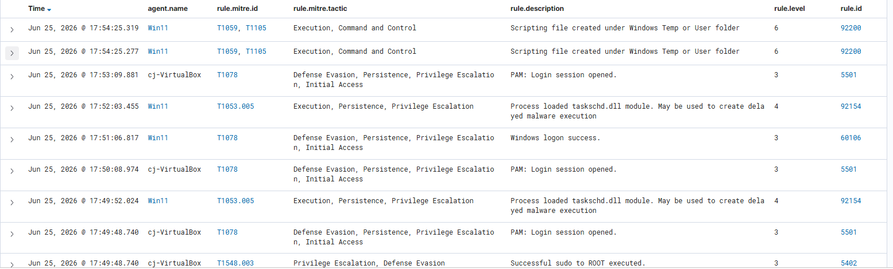

# Example Detections
To validate the functionality of the Wazuh SIEM deployment, several Atomic Red Team tests were executed on the Windows 11 endpoint.
 The simulations generated security alerts that were successfully collected by the Wazuh agent, processed by the manager,
 and displayed in the Wazuh dashboard. Each alert was automatically mapped to the corresponding MITRE ATT&CK technique,
  demonstrating that endpoint telemetry from Sysmon was being correctly analyzed.

## Detection 1 – PowerShell Script Created in User Temporary Directory
- Agent: Win11
## MITRE ATT&CK
- T1059 : Command and Scripting Interpreter
- T1105 : Ingress Tool Transfer
- Severity: Level 6 (Medium)
## Analysis
- This alert was generated when PowerShell created a temporary script inside the user's temporary directory during an Atomic Red Team test.
Attackers commonly drop payloads or scripts into temporary directories because they are writable by standard users and often overlooked during manual investigations.
